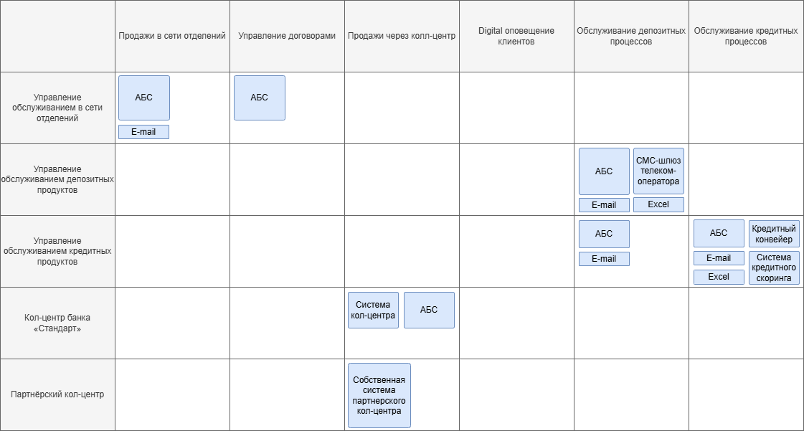
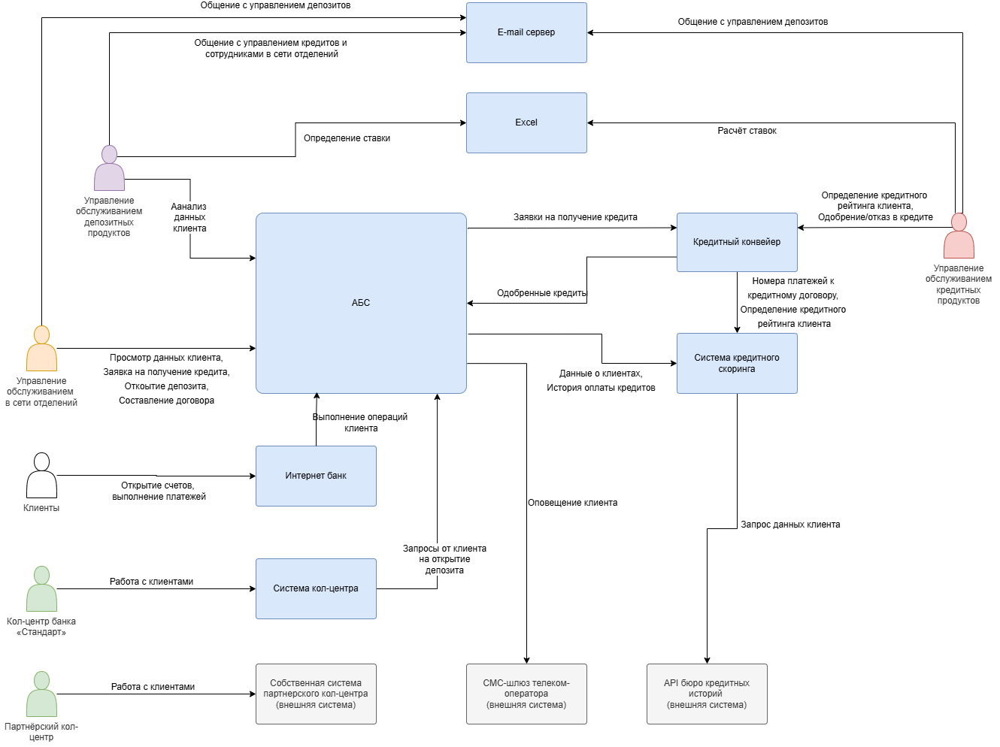
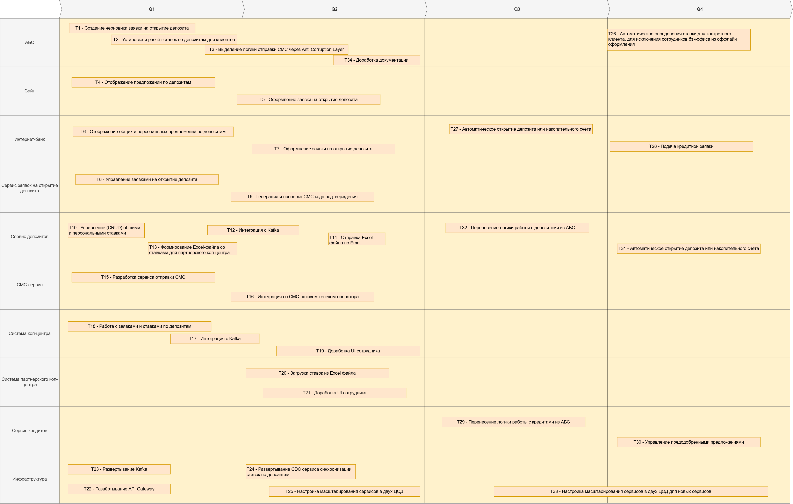

## architecture-pro-standart

### Задание 1

**Карта IT ландшафта:**

[Карта IT ландшафта в draw.io](Task1/карта-it-ландшафта.drawio)

**Cхема интеграции приложений:**

[Схема интеграции приложений в draw.io](Task1/схема-интеграции-приложений.drawio)

### Задание 2

[Архитектурно значимые требования в FURPS+](Task2/архитектурно-значимые-требования.md)

[Все требования в FURPS+](Task2/все-требования.md)

### Задание 3

[Открытие депозитов онлайн в форме ADR](Task3/открытие-депозитов-онлайн-ADR.md)

### Задание 4

[Передача ставок в кол центр в форме ADR](Task4/передача-ставок-в-кол-центр-ADR.md)

[Список крупных задач](Task4/список-крупных-задач.md)

[Road map в drawio](Task4/road-map.drawio)

