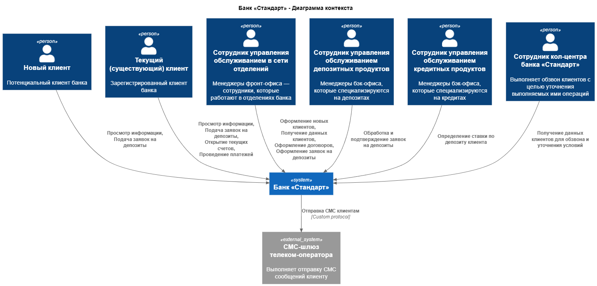
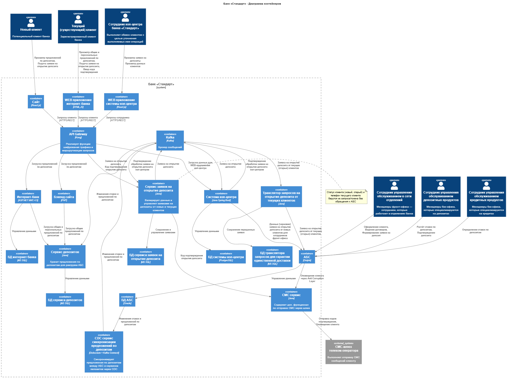

### **Название задачи:** Открытие депозитов онлайн
### **Автор:** Федотов М. В.
### **Дата:** 31.07.2026
### **Функциональные требования**

|**№**|**Действующие лица или системы**|**Use Case**|**Описание**|**Комментарий**|
| :-: | :- | :- | :- | :- |
|UC1|Новый клиент, Сайт, Сервис депозитов|Просмотр предложений|1. Клиент заходит на сайт 2. Клиент открывает раздел депозитов 3. Сайт загружает список доступных депозитов со ставками и отображает их|F1
|UC2|Новый клиент, Сайт, Сервис заявок на открытие депозита, Система кол-центра|Заявка на открытие депозита новым клиентом |1. Клиент находится в разделе депозитов 2. Клиент нажимает на предложение 3.Клиент вводит ФИО и номер телефона 4. Данные клиента и выбранное предложение отправляются в сервис заявок на открытие депозита 5. Данные клиента и выбранное предложение отправляются в систему кол-центра|F2
|UC3|Сотрудник кол-центра банка Стандарт, Система кол-центра, Сервис заявок на открытие депозита, АБС|Уточнение заявки на открытие депозита для нового клиента|1. Сотрудник кол-центра банка Стандарт заходит в систему кол-центра 2. Сотрудник выполняет обзвон потенциальных клиентов по списку заявок и уточняет условия открытия депозита 3. Сотрудник уточняет заявку и заводит черновик в АБС для сотрудников фронт-офиса, 4. Сотрудник кол-центра банка Стандарт подтверждает обработку заявки в сервисе заявок на открытие депозита|F3
|UC4|Новый клиент, Управление обслуживанием в сети отделений, АБС|Идентификация нового клиента в банке|1. Клиент приходит в банк 2. Сотрудник фронт-офиса получает данные (черновик) заявки из АБС 3. Сотрудник фронт-офиса получает документы клиента и регистрирует его в системе и интернет-банке, 4. Сотрудник фронт-офиса удаляет черновик заявки из АБС, 5. Сотрудник фронт-офиса создаёт заявку на открытие депозита для нового идентифицированного клиента в АБС|F6
|UC5|Текущий (старый) клиент, Интернет-банк, Сервис депозитов|Просмотр предложений|1. Клиент заходит в интернет-банк 2. Клиент открывает раздел депозитов 3. Интернет-банк загружает список доступных депозитов с общими ставками и персональные предложения, и отображает их|F7
|UC6|Текущий (старый) клиент, Интернет-банк, Сервис заявок на открытие депозита, СМС-шлюз телеком-оператора, АБС|Заявка на открытие депозита текущим клиентом |1. Клиент находится в разделе депозитов интернет-банка 2. Клиент нажимает на общее или персональное предложение 3.Клиент выбирает счёт и сумму депозита 4. Данные клиента и выбранное предложение отправляются в сервис заявок на открытие депозита 5. Клиенту высылается СМС с кодом подтверждения 6. Клиент вводит код подтверждения в специальное поле в интернет-банке 7. Сервис заявок на открытие депозита формирует заявку в АБС|F7+F8+F9
|UC7|Управление обслуживанием депозитных продуктов, Управление обслуживанием кредитных продуктов, АБС, СМС-шлюз телеком-оператора|Подтверждение депозита клиенту|1. Сотрудник управления депозитами получает данные клиента и запускает стандартную процедуру согласования депозита с участием сотрудников бэк-офиса кредитов 2. Сотрудник управления депозитами фиксирует депозит по уточнённой ставке в АБС 3. АБС информирует клиента об одобрении депозита по СМС|F4+F5+F10

### **Нефункциональные требования**

Нефункциональные и архитектурно значимые требования:

|**№**|**Требование**|
| :-: | :- |
| F   | **Функциональные (Functionality)**                                                                           
| F3  | Сотрудник кол-центра банка Стандарт должен видеть заявку на депозит, оставленную новым клиентом на сайте                     
| F10 | Сотрудники бэк-офиса депозитов и бэк-офиса кредитов должны работать со ставками по депозитам в рамках АБС    
| R   | **Надёжность (Reliability)**                                                                                 
| R1  | Все сервисы должны работать 24/7 и быть доступны в 99,9% случаев                                             
| R2  | Интернет-банк должны работать 24/7 и быть доступны в 99,9% случаев                                           
| P   | **Производительность (Performance)**                                                                         
| P1  | Отклик по всем операциям должен занимать миллисекунды                                                        
| +R  | **+ Ограничения (Restrictions)**                                                                             
| +R1 | Необходимо использовать, по возможности, только СУБД MS SQL и Oracle                                         
| +R2 | Новые технологии, должны быть совместимы с существующими платформами разработки
| +R3 | Сотрудники должны понимать новые технологии хотя бы на уровне языков программирования
| +R4 | В качестве очереди сообщений рекомендуется использовать Kafka                                                
| +R5 | Рекомендуется перевести интернет-банк на микросервисную архитектуру                                          
| +R6 | Требуется обеспечить равномерное горизонтальное масштабирование запросов между серверами, приложениями и ЦОД 
| +R7 | Трафик при работе с сайтом и интернет-банком необходимо защищать с помощью механизма шифрования              
| +R8 | Рекомендуется реализовать функционал работы с СМС силами команды банка                                       
| +R11| Рекомендуется избегать прямой работы интернет-банка с API АБС в новом процессе                                                           

### **Решение**

**Ключевые компоненты:**

* API Gateway:
  + Обеспечивает единую точку входа для внешних пользователей для безопасности.
  + Выполняет шифрование данных пользователtq
  + Выполняет функцию маршрутизации для сокрытия сложностей взаимодействия микросервисов.
  + Выполняет балансировку нагрузки
* Сервис заявок на открытие депозитов - Служит для хранения заявок на открытие депозитов от новых и старых пользователей. Принимается, что данные старых пользователей (включая телефон для оповещения) может быть получен через claims токена, который передавается от авторизованного клиента в процессе запроса. Генерирует проверочный код.
* Сервис депозитов - Служит для хранения предложений и ставок по депозитам и снижения нагрузки на АБС.
* Kafka:
  + Используется для уменьшения связности между сервисами.
  + Устраняет лавинообразный эффект синхронного взаимодействия при увеличении нагрузки.
  + Упрощает масштабирование сервисов при высокой нагрузке.
  + Сохраняет сообщения для повышения надежности. 
* Сервис трансляции запросов на открытие депозита от текущих клиентов - служит для синхронизации заявок от текущих (старых) клиентов между новым сервисом заявок на открытие депозитов и АБС. Необходим как адаптер, т.к. АБС не совместим с Kafka, но имеет API для добавления заявок на оформление депозитов.
* CDC сервис синхронизации предложений по депозитам - ввиду того, что изменение монолита АБС трудоемко и не входит в задачи MVP, используется Debezium + Kafka Connect для синхронизации изменений между БД АБС и новым сервисом депозитов через Kafka.
* СМС сервис - может быть выделен из АБС для устранения зависимости от внешней команды разработки. 

**Логика принятия решений и выбора технологий:**

* F3 - За счёт передачи данных по заявкам от новых клиентов непосредственно в кол-центр банка, сотрудники кол центра имеют прямой доступ к данным заявок.
* F10 - Все действия по расчету ставки по депозиту перемещены в АБС, как того требуют стейкхолдеры. Excel и Email не используются в работе сотрудников бэк-офиса.
* R1, R2 - За счёт использования новых легких микросервисов для работы с заявками и ставками по депозитам, настройка автоматического масштабирования значительно упрощается. Кроме того, данные сервисы могут работать независимо от тяжелой АБС и поддерживать работоспособность сайта и интернет-банка даже в случае падения АБС. Этого положительно сказывается на требовании обеспечить работоспособность сайта и интернет-банка 24/7.
* P1 - За счёт использования новых легковесных микросервисов с собственными БД и возможно кэшем, а также CDC сервиса синхронизации предложений, удастся исключить перегруженную АБС из запросов web-приложений
* +R1, +R2 - В новых сервисах используются только базы данных MS SQL и Oracle, т.к. этого явно требуют стейкхолдеры.
* +R2 - CDC сервис синхронизации позволяет избежать переписывания кода в АБС.
* +R3 - Новые сервисы написаны на Java. Сотрудники знакомы с платформой, т.к. выполняют доработку кредитного конвейера. 
* +R4 - Для передачи сообщений используется Kafka. Для связки с АБС используется адаптер.
* +R6 - За счёт использования новых легковесных сервисов и Kafka, обеспечить равномерное горизонтальное масштабирование запросов между серверами станет проще
* +R7 - За счёт использования API Gateway обеспечить шифрование трафика при работе с сайтом и интернет-банком  становится проще
* +R8 - Функционал работы с СМС вынесен в отдельный сервис. Его можно разработать и поддерживать силами команды. При наличии времени можно осуществить миграцию этой логики из АБС через Anti Corruption Layer.
* +R11 - За счёт использования Kafka и новых сервисов для работы с заявками и хранения ставок удалось исключить перегруженную АБС из цикла предварительного уточнения деталей депозита и избежать прямой работы интернет-банка с API АБС в новом процессе

**Диаграмма контекста:**

[Диаграмма контекста в puml](диаграмма-контекста.puml)

**Диаграмма контейнеров:**

[Диаграмма контейнеров в puml](диаграмма-контейнеров.puml)

### **Альтернативы**

* В качестве языка программирования для новых сервисов можно было бы выбрать Delphi, с которым сотрудники хорошо знакомы, однако этот язык имеет меньшую экосистему в контексте разработки микросервисов.
* Можно разгрузить АБС ещё больше, если сотрудник кол-центра не будет передавать черновики заявок от новых клиентов в АБС, а, вместо этого, держать их в сервисе заявок на открытие депозита. Однако в этом случае потребуется писать дополнительный web-клиент для сотрудников фронт офиса и обучать их работе с ним. Учитывая разветвленную сеть офисов и большое кол-во сотрудников, это будет сложно реализовать в рамках MVP и может привести к появлению задержек в обслуживании и формированию большого числа ошибок в процессе работы операторов фронт-офиса с клиентами.
* Синхронные запросы из Интернет-банка в АБС для получения ставок и данных клиентов. Нарушает +R11 и создает риск лавинообразного эффекта и рекурсивного падения сервисов при недоступности АБС. Также, не удовлетворяет требованию доступности сервисов и системы.
* Добавление дополнительной логики синхронизации изменений ставок и предложений (через Anti Corruption Layer) прямо в АБС вместо CDC. Нарушает рекомендации стейкхолдеров по невмешательству в текущую работу АБС, а также является более сложным в реализации по сравнению с готовым решением промышленного класса.

**Недостатки, ограничения, риски**

* Использование асинхронного паттерна взаимодействия между микросервисами приведёт к тому, что могут возникать задержки между фактическим моментом оформления заявки и началом её обработки в периоды высокой нагруженности.
* Также, использование асинхронного паттерна приведёт к тому, что актуальные ставки будут появляться на сайте и в интернет-банке с задержкой, что может привести к ошибкам и недовольству текущих, и потенциальных клиентов.
* Выделение внешнего СМС сервиса потребует добработок АБС, но окупится в будущем за счет простого масштабирования.
* Использование новых технологий Kafka и CDC потребует обучения команды разработчиков, но позволит сэкономить на времени разработки/миграции.
* Использование Kafka и CDC усложнит отладку и мониторинг системы. 
* Из-за использования CDC, изменение структуры БД потребует и изменения консьюмера данных.
