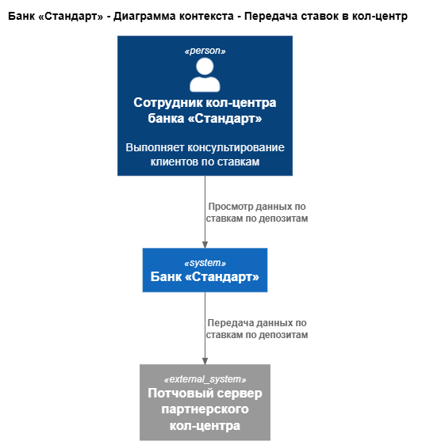
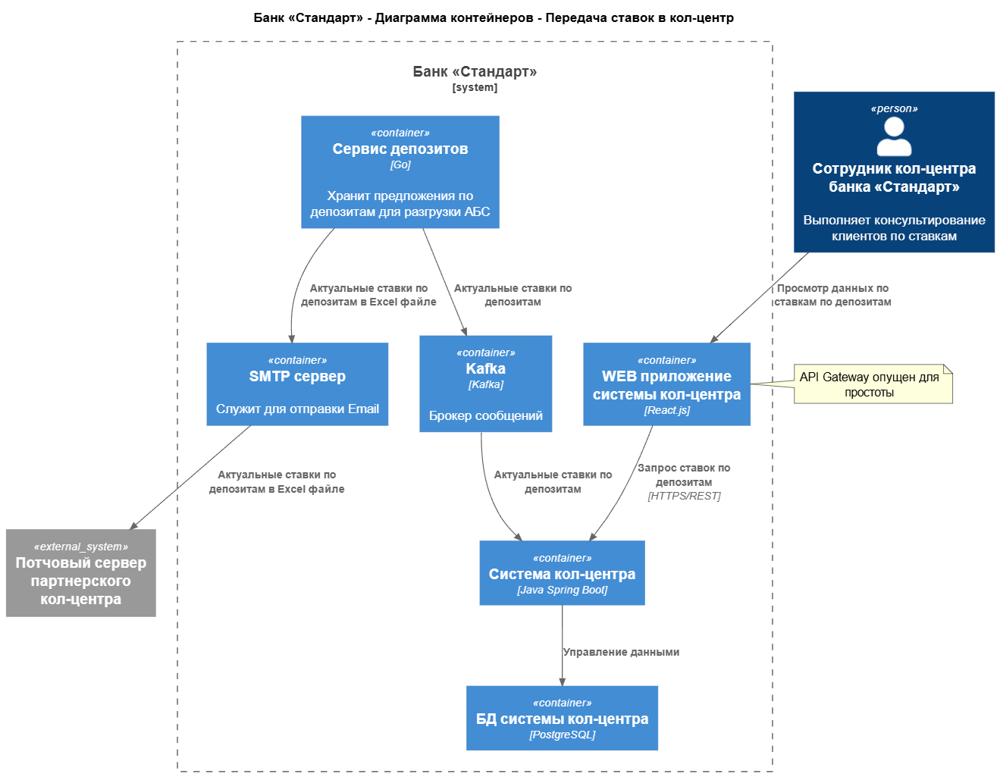

### **Название задачи:** Передача ставок в кол-центр
### **Автор:** Федотов М. В.
### **Дата:** 01.08.2026
### **Функциональные требования**

|**№**|**Действующие лица или системы**|**Use Case**|**Описание**|
| :-: | :- | :- | :- |
|UC8|Сервис депозитов, Kafka, Система кол-центра|Передача ставок в кол-центр банка Стандарт|1. Актуальные ставки содержатся в сервисе депозитов 2. Сервис депозитов пересылает ставки в Kafka в согласованном формате 3. Система кол-центра считывает ставки из Kafka и сохраняет в своей БД 4. Ставки загружаются в UI системы кол-центра и становятся доступны операторам|
|UC9|Сервис депозитов, SMTP сервер банка, Email сервер партнёрского кол-центра, Система партнёрского кол-центра|Передача ставок в партнёрский кол-центр|1. Актуальные ставки содержатся в сервисе депозитов 2. Сервис депозитов пересылает ставки в согласованном Excel файле по Email в виде вложения в открытом виде. Сам Excel файл подписан ЭЦП. 3. Сотрудник партнерского кол-центра скачивает полученный в письме файл и проверяет что данные не повреждены и пришли от доверенного источника на основании подписи. 4. Сотрудник партнерского кол-центра (или их внутренняя система автоматизации) загружает данные из файла в систему партнерского кол-центра 5. Ставки загружаются в UI системы партнерского кол-центра и становятся доступны операторам|

### **Нефункциональные требования**

Нефункциональные требования и архитектурно значимые требования:

|**№**|**Требование**|
| :-: | :- |
|+R4|В качестве очереди сообщений рекомендуется использовать Kafka|
|+R12|Кол-центр партнёра должен продолжать работать во внешней информационной системе относительно банка|
|+R13|Разрешено пересылать ставки в кол-центр партнёра в виде файлов|
|+R14|Запрещено пересылать ставки в кол-центр партнёра через API-вызовы|
### **Решение**

**Ключевые компоненты:**

* Сервис депозитов - служит для хранения предложений и ставок по депозитам и снижения нагрузки на АБС.
* Kafka теперь дополнительно ипользуется для передачи ставок в кол-центр банка.
* SMTP сервер служит для отправки файла со ставками в партнёрский кол-центр.

**Логика принятия решений и выбора технологий:**

* Ставки внутри системы в кол-центр банка приходят через Kafka, т.к. этот механизм уже используется для передачи заявок в кол-центр и будет знаком разработчикам.
* Ставки в партнёрский кол-центр передаются по Email с помощью Excel файла. Это решение соответствует требованиям и ограничениям партнерского кол-центра. Оно не описывает как именно файл загружается в систему партнерского кол-центра - ручным или автоматическим способом. В худшем случае, данные можно читать прямо из него без какой либо автоматизации.
* Из-за передачи данных в партнерский кол-центр в виде файла по Email, т.к. протокол SMTP слабо защищён, теоретически, злоумышленник может подделать письмо. Чтобы этого не произошло, письмо приходит с подписью, по которой оператор может проверить что файл не повреждён и пришёл именно от банка. 
* Сам файл, при этом не нуждается в шифровании, т.к. передаются только общие ставки банка. Они не подпадают под категорию служебных или личных данных пользователей и отображаются на сайте.
* SMTP сервер, судя по описанию, в банке уже имеется, т.к. сотрудники фронт- и бэк-офисов, в настоящий момент, общаются между собой по Email. Значит, работы по развертыванию не требуются.

**Диаграмма контекста:**

[Диаграмма контекста в puml](диаграмма-контекста.puml)

**Диаграмма контейнеров:**

[Диаграмма контейнеров в puml](диаграмма-контейнеров.puml)

### **Альтернативы**

* Задача отправки ставок по Email может быть реализована путем ручной отправки письма сотрудником бэк-офиса кредитов. К этому варианту можно перейти, если у команды не будет хватать времени на реализацию данной функции в рамках MVP.

**Недостатки, ограничения, риски**

* Из-за асинхронного взаимодействия АБС и кол-центра банка Стандарт, актуальные ставки будут приходить к операторам с задержкой. 
* Из-за асинхронного взаимодействия АБС и кол-центра банка Стандарт, если в системе произойдет сбой, задержки могут быть значительны. Это может привести к рассинхронизации - операторы не будут знать актуальные ставки, хотя они уже будут видны пользователям на сайте и в интернет-банке. Это, в свою очередь, может привести к потере клиентов.
* Из-за передачи данных в партнерский кол-центр в виде файла по Email, ситуация полностью повторяет природу проблем описанную выше, но усугубляется ещё сильнее. 
* Из-за передачи данных в партнерский кол-центр в виде файла по Email, потребуется дополнительная процедура проверки что файл не поврежден и отправлен доверенным отправителем - банком. Это накладывает дополнительную ответственность на сотрудников партнерского кол-центра.
