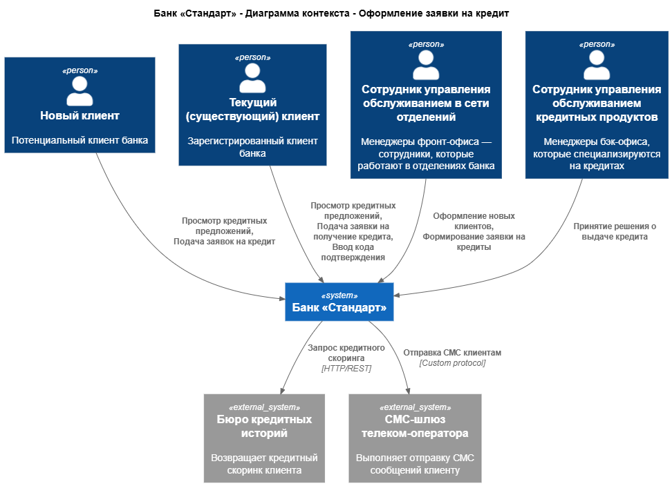
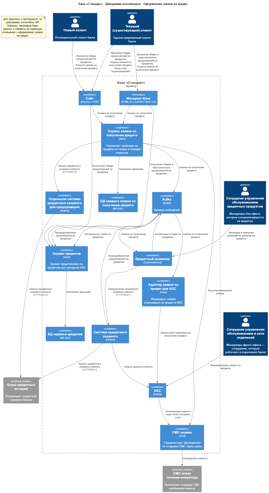

### **Название задачи:** Оформление заявки на кредит онлайн
### **Автор:** Федотов М. В.
### **Дата:** 01.08.2026
### **Функциональные требования**

|**№**|**Действующие лица или системы**|**Use Case**|**Описание**|**Комментарий**|
| :-: | :- | :- | :- | :- |
|UC10|Новый клиент, Сайт, Сервис кредитов|Просмотр предложений по кредитам|1. Клиент заходит на сайт 2. Клиент открывает раздел кредитов 3. Сайт загружает список доступных кредитов со ставками и отображает их|F11
|UC11|Новый клиент, Сайт, Сервис заявок на получение кредита, АБС, СМС шлюз|Заявка на открытие кредита новым клиентом |1. Клиент находится в разделе кредитов 2. Клиент нажимает на предложение 3.Клиент вводит ФИО и номер телефона 4. Данные клиента и выбранное предложение отправляются в Сервис заявок на получение кредита 5. В АБС создаётся черновик запроса на получение кредита для сотрудников фронт-офиса 6. Клиенту высылается СМС с приглашением в банк|F12+F14
|UC12|Новый клиент, Сайт, Сервис заявок на получение кредита, БКИ, АБС, СМС шлюз|Заявка на открытие кредита новым клиентом с предпросмотром результата|1. Клиент находится в разделе кредитов 2. Клиент нажимает на предложение 3.Клиент вводит ФИО, номер телефона и паспортные данные 4. Данные клиента и выбранное предложение отправляются в Сервис заявок на получение кредита 5. Сервис заявок опосредованно обращается в БКИ для получения данных нового клиента и определяет, может ли быть выдан кредит, 6. Статус одобрения кредита отображается клиенту 7. Клиент подтверждает оформление кредита 8. Данные клиента и выбранное предложение отправляются в Сервис заявок на получение кредита, 9. В АБС создаётся черновик запроса на получение кредита для сотрудников фронт-офиса 10. Клиенту высылается СМС с приглашением в банк|F13+F14
|UC13|Новый клиент, Управление обслуживанием в сети отделений, АБС|Оформление заявки на выдачу кредита для нового клиента в отделении банка с предварительным одобрением|1. Клиент приходит в банк 2. Сотрудник фронт-офиса получает документы клиента 3. Сотрудник фронт-офиса получает данные (черновик) заявки из АБС 4. Сотрудник фронт-офиса перепроверяет условия по кредиту и сообщает фактические условия клиенту, 5. Клиент подтверждает желание получения кредита 6. Сотрудник фронт-офиса регистрирует клиента в системе и интернет-банке 7. Сотрудник фронт-офиса создаёт заявку на открытие кредита для нового идентифицированного клиента в АБС|F15
|UC14|Новый клиент, Управление обслуживанием в сети отделений, АБС|Оформление заявки на выдачу кредита для нового клиента в отделении банка без предварительного одобрения|1. Клиент приходит в банк 2. Сотрудник фронт-офиса получает документы клиента 3. Сотрудник фронт-офиса определяет условия по кредиту и сообщает их клиенту, 4. Клиент подтверждает желание получения кредита 5. Сотрудник фронт-офиса регистрирует клиента в системе и интернет-банке 6. Сотрудник фронт-офиса создаёт заявку на открытие кредита для нового идентифицированного клиента в АБС|
|UC15|Текущий (старый) клиент, Интернет-банк, Сервис кредитов|Просмотр предложений по кредитам|1. Клиент заходит в интернет-банк 2. Клиент открывает раздел кредитов 3. Интернет-банк загружает список доступных кредитов с общими ставками и персональные предложения, и отображает их|F16+F17
|UC16|Текущий (старый) клиент, Интернет-банк, Сервис заявок на получение кредита, БКИ, АБС, СМС шлюз|Заявка на открытие кредита текущим (старым) клиентом|1. Клиент находится в разделе кредитов 2. Клиент нажимает на предложение 3.Клиент выбирает счёт зачисления и другие данные 4. Данные клиента и выбранное предложение отправляются в Сервис заявок на получение кредита 5. Клиенту высылается СМС с кодом подтверждения, 6. Клиент вводит код подтверждения в специальное поле в интернет-банке 7. В АБС создаётся запрос на получение кредита 8. Клиенту высылается СМС об изменении статуса (в работе)|F19+F20+F21

### **Нефункциональные требования**

Нефункциональные и архитектурно значимые требования:

|**№**|**Требование**|
| :-: | :- |
| R   | **Надёжность (Reliability)**                                                                                 
| R1  | Все сервисы должны работать 24/7 и быть доступны в 99,9% случаев                                             
| R2  | Интернет-банк должны работать 24/7 и быть доступны в 99,9% случаев 
| P   | **Производительность (Performance)**                                                                         
| P1  | Отклик по всем операциям должен занимать миллисекунды                                                        
| P2  | Заявки на кредит по предодобренным предложениям должны обрабатываться в течение того же рабочего дня
| +R  | **+ Ограничения (Restrictions)**                                                                              
| +R1 | Необходимо использовать, по возможности, только СУБД MS SQL и Oracle                                         
| +R2 | Новые технологии, должны быть совместимы с существующими платформами разработки
| +R3 | Сотрудники должны понимать новые технологии хотя бы на уровне языков программирования
| +R4 | В качестве очереди сообщений рекомендуется использовать Kafka                                          
| +R8 | Рекомендуется реализовать функционал работы с СМС силами команды банка                                       
| +R10| Запрещено нагружать систему кредитного скоринга дополнительными процессами по предрасчетам скорингов         

### **Решение**

**Ключевые компоненты:**

* Сервис заявок на получение кредита - Служит для хранения заявок на получение кредита от новых и старых пользователей. Принимается, что данные старых пользователей (включая телефон для оповещения) может быть получен через claims токена, который передавается от авторизованного клиента в процессе запроса. Генерирует проверочный код.
* Сервис кредитов - Служит для хранения предложений и ставок по кредитам и снижения нагрузки на АБС.
* Kafka:
  + Используется для уменьшения связности между сервисами.
  + Устраняет лавинообразный эффект синхронного взаимодействия при увеличении нагрузки.
  + Упрощает масштабирование сервисов при высокой нагрузке.
  + Сохраняет сообщения для повышения надежности. 
* Отдельная система кредитного скоринга для предпроверок - использует те же библиотеки и ML модели что и основная системя но служит для её разгрузки при определении кредитного скоринга для новых клиентов перед принятием заявки. Используется для того, чтобы не перегружать основную систему скоринга запросами данного типа.
* Адаптер заявок на кредит для АБС - служит для формирования заявок в АБС минуя фронт-офис через API АБС.
* СМС сервис - может быть выделен из АБС для устранения зависимости от внешней команды разработки. 

**Логика принятия решений и выбора технологий:**

* P1 - За счёт использования новых легковесных микросервисов с собственными БД, удастся исключить перегруженную АБС из запросов web-приложений
* P2 - Заявки на открытие кредита теперь поступают в кредитный конвейер из сервиса заявок через Kafka в обход АБС. Это проиходит при либо при создании заявки, либо несколько раз в сутки в зависимости от настроек и позволяет выполнить требование обработки заявки в течение суток. 
* +R1, +R2 - В новых сервисах используются только базы данных MS SQL, т.к. этого явно требуют стейкхолдеры.
* +R3 - Новые сервисы написаны на Java и Python. Сотрудники знакомы с платформами, т.к. выполняют доработку кредитного конвейера и разработку кредитного скоринга. 
* +R4 - Для передачи сообщений используется Kafka. Для связки с АБС используется адаптер.
* +R8 - Функционал работы с СМС вынесен в отдельный сервис. Его можно разработать и поддерживать силами команды. При наличии времени можно осуществить миграцию этой логики из АБС через Anti Corruption Layer.
* +R10 - За счёт использования новых микросервисов, дополнительная нагрузка на систему скоринга не создаётся.

**Диаграмма контекста:**

[Диаграмма контекста в puml](диаграмма-контекста.puml)

**Диаграмма контейнеров:**

[Диаграмма контейнеров в puml](диаграмма-контейнеров.puml)

### **Альтернативы**

* Вместо интеграции кредитного конвейера и Kafka, можно было получать актуальные ставки из БД АБС через CDC. Это более простое решение, т.к. не треюует доработок кредитного конвейера, но тогда данные поступали бы с существенной задержкой. Кроме того, изменение структуры БД потребует и изменения консьюмера данных.
* Синхронные запросы из Интернет-банка в АБС для получения ставок и данных клиентов. Нарушает требования и создает риск лавинообразного эффекта и рекурсивного падения сервисов при недоступности АБС. 
* Вместо добавления отдельного сервиса расчёта скоринга, можно горизонтально масштабировать текущий сервис скоринга и обращаться к нему в периоды неактивности. Но данное решение потребует дополнительных вложений в мониторинг и более сложное в реализации.

**Недостатки, ограничения, риски**

* Использование асинхронного паттерна взаимодействия между микросервисами приведёт к тому, что могут возникать задержки между фактическим моментом оформления заявки и началом её обработки в периоды высокой нагруженности.
* Также, использование асинхронного паттерна приведёт к тому, что актуальные ставки будут появляться на сайте и в интернет-банке с задержкой, что может привести к ошибкам и недовольству текущих, и потенциальных клиентов.
* Выделение внешнего СМС сервиса потребует добработок АБС, но окупится в будущем за счет простого масштабирования.
* Использование отдельной системы кредитного скоринга для предпроверок потребует дублирования действий дата-сайентистов при оьновлении моделей расчёта скоринга.
* Использование новых технологий Kafka потребует обучения команды разработчиков, но позволит сэкономить на времени разработки/миграции.
* Использование Kafka усложнит отладку и мониторинг системы.
